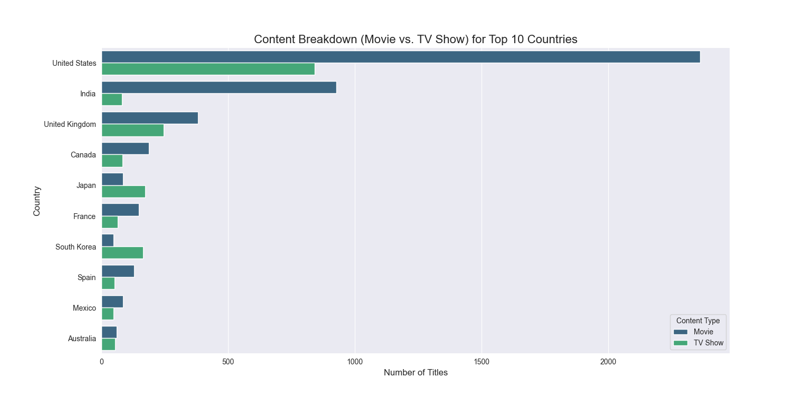

# Week 3: Exploratory Data Analysis (EDA) on Netflix Content

**Intern:** Mohammed Anwar Qureshi
**Task:** Task 03 - Exploratory Data Analysis

---

## 1. Project Goal

The goal of this project was to perform a comprehensive Exploratory Data Analysis (EDA) on the Netflix Movies and TV Shows dataset. The analysis aimed to uncover trends, patterns, and insights into the platform's content strategy and library composition.

## 2. Project Workflow

The project followed a standard data analysis workflow:
1.  **Data Loading & Inspection:** Loaded the raw dataset and performed an initial assessment of its structure and data quality.
2.  **Data Cleaning & Preprocessing:** Handled missing values by filling or dropping them, and converted columns to their appropriate data types (e.g., `datetime`).
3.  **Analysis & Visualization:** Asked and answered key questions about the data using a variety of advanced visualizations, including donut charts, area charts, and grouped bar charts, to tell a compelling story.
4.  **Insight Summarization:** Concluded the project by summarizing the key findings from the analysis.

## 3. Tools and Libraries Used

* **Python**
* **Pandas:** For data cleaning and manipulation.
* **Matplotlib & Seaborn:** For creating a wide range of static visualizations.
* **Plotly :** For creating advanced interactive charts like choropleth maps and treemaps.

## 4. Key Findings

The analysis revealed several key insights into Netflix's content strategy:
* The library is heavily skewed towards **Movies** over TV Shows.
* Netflix saw an **explosive growth** in content acquisition, which peaked around 2019.
* The **United States and India** are the top two content-producing countries, a trend that is also reflected in the data for top actors and directors.

## 5. Featured Visualization

The chart below shows the breakdown of content types (Movies vs. TV Shows) for the top 10 content-producing countries, highlighting key strategic differences.

