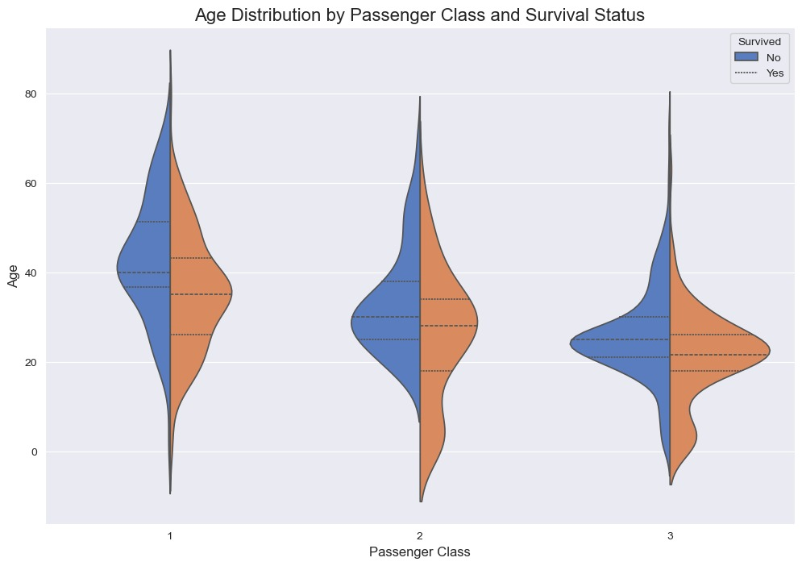

# Week 4: Titanic Survival - An In-Depth Exploratory Data Analysis

**Intern:** Mohammed Anwar Qureshi
**Task:** Task 04 - Titanic Dataset EDA

---

## 1. Project Goal

The objective was to perform a deep Exploratory Data Analysis (EDA) on the classic Titanic dataset to identify and visualize the key factors influencing passenger survival during the disaster. The focus was on thoughtful data cleaning, insightful feature engineering, and advanced visualization techniques.

## 2. Project Workflow & Key Decisions

1.  **Data Loading & Initial Inspection:** Loaded the `train.csv` dataset and identified key data quality issues, particularly missing `Age`, `Cabin`, and `Embarked` values.
2.  **Advanced Data Cleaning & Feature Engineering:**
    * Handled missing `Age` using **median imputation grouped by `Pclass` and `Sex`** to preserve underlying data structures.
    * Filled missing `Embarked` values using the mode.
    * Engineered a `Has_Cabin` feature as a proxy for socio-economic status, derived from the pattern of missing `Cabin` data, and dropped the original noisy `Cabin` column.
    * Created a `FamilySize` feature by combining `SibSp` and `Parch` to better capture group dynamics.
3.  **Multi-dimensional Visualization:** Moved beyond basic plots to explore interactions between features using violin plots and FacetGrids, answering questions about how factors like age, class, and gender jointly influenced survival.
4.  **Correlation Analysis & Insight Summarization:** Used a heatmap for statistical correlation and summarized the key drivers of survival.

## 3. Tools and Libraries Used

* **Python**
* **Pandas & NumPy:** For data cleaning, imputation, and feature engineering.
* **Matplotlib & Seaborn:** For creating a wide range of static and advanced visualizations (countplots, histograms, violin plots, FacetGrids, heatmaps).

## 4. Key Findings

* **Gender and Class:** Survival strongly favored females and passengers in higher classes (1st > 2nd > 3rd).
* **Age Nuances:** Young children had a higher survival rate, but this varied significantly across different passenger classes.
* **Family Size Impact:** Small families (2-4 members) had the best survival odds compared to those traveling alone or in large groups.
* **Proxy Features:** The engineered `Has_Cabin` feature showed a strong positive correlation with survival, validating its use as a proxy for status.

## 5. Featured Visualization

The violin plot below effectively visualizes the complex interaction between Age, Passenger Class, and Survival status, highlighting different survival patterns across socio-economic groups.

